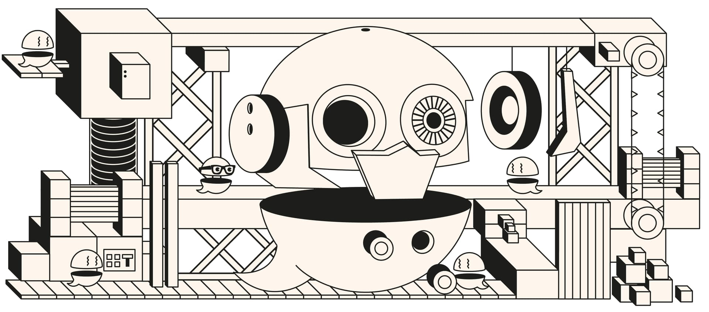

# Aave Governance V3 Robot

This repository contains the smart contracts and backend for automating governance actions of Aave Governance V3 using Chainlink Automation and Chainlink API. Actions the robot executes on the governance contracts are also public and could be executed by anyone in a permissionless way.

## Specifications

Extensive documentation about the architecture and design of the system can be found [HERE](./docs/overview.md).

## Setup instructions

All the information about the setup of the project and deployments can be found [HERE](./docs/setup.md).

## Deployed Robots

List of all the deployed robots could be found [HERE](https://github.com/bgd-labs/aave-robots-list).

## License

Copyright © 2026, Aave DAO, represented by its governance smart contracts.

Created by [BGD Labs](https://bgdlabs.com/).

The default license of this repository is [BUSL1.1](./LICENSE), but all interfaces and the content of the [libraries folder](./src/contracts/libraries/) are open source, MIT-licensed.

**IMPORTANT**. The BUSL1.1 license of this repository allows for any usage of the software, if respecting the *Additional Use Grant* limitations, forbidding any use case damaging anyhow the Aave DAO's interests.
