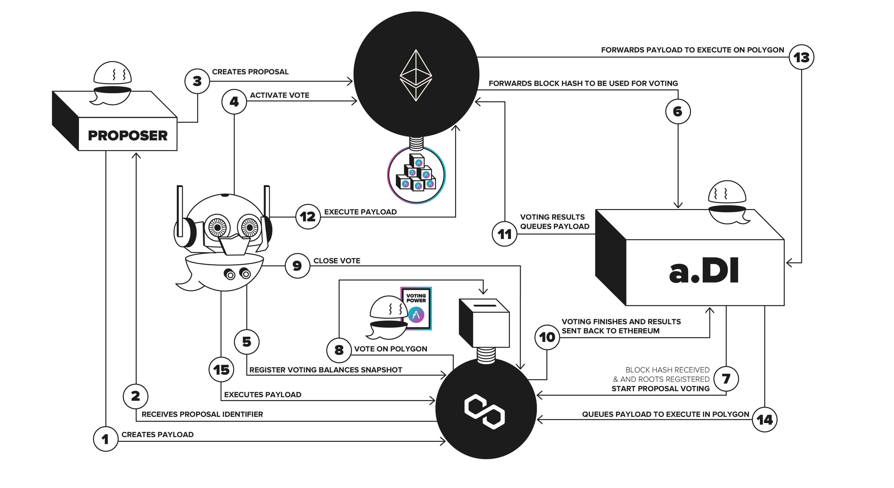

# Aave Governance V3 Robot Overview

## Proposal Lifecycle:

You can find more information on the proposal lifecycle [here](https://github.com/bgd-labs/aave-governance-v3#new-proposal-lifecycle).

## Actions performed by the Governance V3 Robot:

- **Activate Voting:**

  After the proposer has created the proposal on the core governance contract on Ethereum and after the delay has passed, the Aave robot will activate voting, which will take the Ethereum block just before this action is called, as a “snapshot” of the Ethereum blockchain state, which will be sent to the Voting Network and used as a source of the voting power.

  Conditions required to activate voting on the governance core contract:

  - The current state of the proposal on the governance chain should be `Created`
  - The time passed since the proposal creation should be more than the cool down period `coolDownBeforeVotingStart` defined in the `votingConfig`.

- **Register Voting Token Roots:**

  After the block hash gets forwarded to the voting network, the Aave Robot will do a permissionless "settlement" of global data used for vote validation: the Ethereum block hash, its state tree, and the state roots of the voting assets.

  Conditions required to register voting token roots on the data warehouse contract:

  - The current state of the proposal on the voting machine is `NotCreated`
  - If the roots have not already been submitted for the `snapshotBlockHash`

- **Create Vote:**

  After the cross-chain infrastructure forwards and registers the proposal configuration on the voting machine on the voting chain and after the voting token roots have been registered, the Aave Robot will create vote, which essentially starts voting on the proposal.

  Conditions required to create vote on the voting machine:

  - The current state of the proposal on the voting machine is `NotCreated`
  - If the roots have been submitted for the `snapshotBlockHash`

- **Close And Send Vote:**

  After the voting period passes, the Aave Robot closes the vote on the proposal specified by its id and sends the results back to the governance chain.

  Conditions required to close and send vote on the voting machine:

  - The current state of the proposal on the voting machine is `NotCreated`

- **Execute Proposal:**

  After the voting results arrive in the governance chain and validating its success requirements and queuing them, the Aave Robot will initiate the execution of the proposal. The execution of the proposal will forward all the payloads for the proposal to their respective chains and queue them via the cross-chain infra.

  Conditions required to execute a proposal on the governance core contract:

  - The current state of the proposal on the governance chain should be `Queued`
  - The current `block.timestamp` should be greater than the sum of the proposal queuing time and the `COOLDOWN_PERIOD`

- **Execute Payload:**

  When the payload is queued, and after the execution time has passed, the Aave Robot executes the payload on the respective network.

  Conditions required to execute a payload on the payload controller:

  - The current state of the payload on the payload controller should be `Queued`
  - The current `block.timestamp` should be greater than the `executionTime`, which is defined as the sum of the payload queued timestamp and delay defined in the `executorConfig`
  - The current `block.timestamp` should also be lesser than the sum of `executionTime` and gracePeriod defined in the `executorConfig`

- **Cancel Proposal:**

  Anytime the proposal state is not `Null`, `Executed`, `Failed`, `Cancelled` or `Expired` and if the proposition power of a proposal creator goes below the minimum proposition power specified in the VotingConfig the Aave Robot cancels the proposal.

  Conditions required to cancel a proposal on the governance core contract:

  - The current state of the proposal on the governance chain should not be `Null`, `Executed`, `Failed`, `Cancelled` or `Expired`.
  - The current proposition power of the proposal creator drops below the minimum proposition power as defined in the `votingConfig`

## Automation Keeper Contracts:

The chainlink automation compatible contracts to perform the automation.

- Governance Chain Keeper:

  The governance chain keeper is deployed only on the governance chain (i.e. mainnet) and is responsible for performing automation on the governance core contract for the following actions: `activateVoting`, `executeProposal`, `cancelProposal`

- Voting Chain Keeper:

  The voting chain keeper is deployed for all the voting chain networks and is responsible for performing the following actions on PayloadsController and the VotingMachine Contract and calling the API consumer to register the roots: `closeAndSendVote`, `createVote`, `executePayload`, `requestSubmitRoots`

The keepers have the following functions:

- `checkUpkeep()`

  This function is called off-chain by chainlink every block to check if any action could be performed, and if so, calls `performUpKeep()`. It loops the last 25 proposals/payloads and checks if any action could be performed on the proposal/payload. If any action could be performed, it checks 25 more proposals to be confident. In case any actions could be performed, it stores them in an array of struct `ActionWithId[]`, which contains the id of the proposal/payload and the action to perform and returns true with the `ActionWithId[]` encoded in params.

- `performUpkeep()`

  This function is called by chainlink when `checkUpKeep()` returns true with the params containing ids and actions to perform. The `performUpKeep()` revalidates again if the actions can be performed. The actions are always executed in order from the first proposal/payload to the last. If any action could be performed, it calls the appropriate contract to perform the action.

  Note:

  - A maximum of 25 actions are returned by `checkUpKeep()` to execute. If there are more actions, they will be performed in the next block by the keeper.

  - For voting chain keeper, we also perform the register roots action for the block hash only once and flag it, as it requests data off-chain to submit roots and to avoid calling it multiple times.

## API Consumer Contract:

The chainlink API consumer-compatible smart contracts are deployed on the voting chain networks to request data off-chain by calling the respective APIs to register the roots for the voting tokens.

The consumer contract contains the following functions:

- `requestSubmitRoots()`

  This function is called by the voting chain keeper, which sends requests to register the roots for the voting tokens. It requests the backend off-chain to get transaction call data containing the roots from the governance chain.

- `fulfillSubmitRoots()`

  This function is a callback function called by the chainlink node operators containing the response from the API requested. The response includes the call data containing the roots of voting tokens from the governance chain in the form of call data for the following functions of the DataWarehouse contract: `processStorageRoot()`, `processStorageSlot()`

  Using the call data response returned, this function then registers the roots of the above functions on the data warehouse contract.
